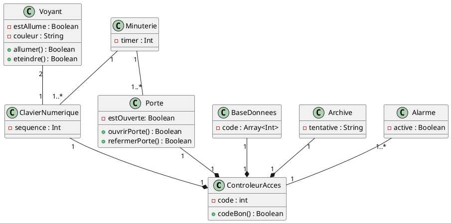

```plantuml
@startuml

class ControleurAcces{
- code : int
+ codeBon() : Boolean
}

class ClavierNumerique{
- sequence : Int
}

class Voyant{
- estAllume : Boolean
- couleur : String
+ allumer() : Boolean
+ eteindre() : Boolean
}

class Porte{
- estOuverte: Boolean
+ ouvrirPorte() : Boolean
+ refermerPorte() : Boolean
}

class BaseDonnees{
- code : Array<Int>
}

class Archive{
- tentative : String
}

class Minuterie{
- timer : Int
}

class Alarme{
- active : Boolean
}

ClavierNumerique "1" --* "1" ControleurAcces
Porte "1" --* "1" ControleurAcces
Archive "1" --* "1" ControleurAcces
BaseDonnees "1" --* "1" ControleurAcces
Alarme "1..*" -- "1" ControleurAcces
Minuterie "1" -- "1..*" ClavierNumerique
Minuterie "1" -- "1..*" Porte
Voyant "2" -- "1" ClavierNumerique

@enduml
```
