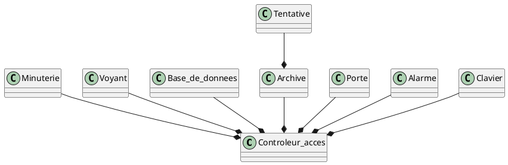

```plantuml
@startuml
class Controleur_acces {
}

class Minuterie {
}

class Voyant {
}

class Base_de_donnees {
}

class Archive {
}

class Porte {
}

class Alarme {
}

class Tentative {
}

Clavier --* Controleur_acces
Minuterie --* Controleur_acces
Voyant --* Controleur_acces
Base_de_donnees --* Controleur_acces
Archive --* Controleur_acces
Tentative --* Archive
Porte --* Controleur_acces
Alarme --* Controleur_acces
@enduml
```
