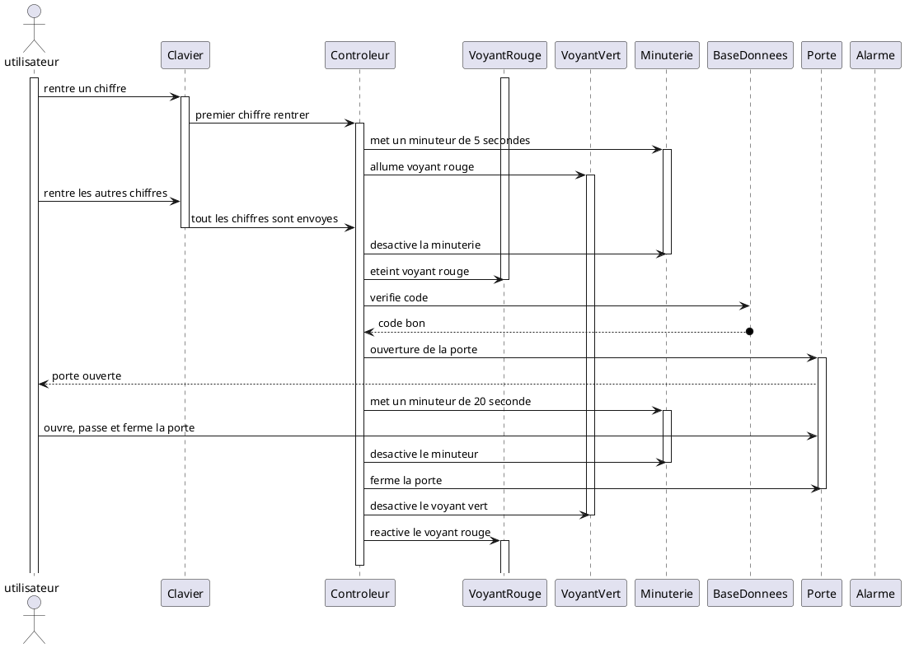

```plantuml
@startuml
actor utilisateur as user
participant Clavier as kBoard
participant Controleur as ctrl
participant VoyantRouge as voyR
participant VoyantVert as voyV
participant Minuterie as minut
participant BaseDonnees as BD
participant Porte as port
participant Alarme as alrm

activate voyR
activate user

user -> kBoard : rentre un chiffre
activate kBoard

kBoard -> ctrl : premier chiffre rentrer
activate ctrl

ctrl -> minut : met un minuteur de 5 secondes
activate minut
ctrl -> voyV : allume voyant rouge
activate voyV

user -> kBoard : rentre les autres chiffres
kBoard -> ctrl : tout les chiffres sont envoyes
deactivate kBoard

ctrl -> minut : desactive la minuterie
deactivate minut
ctrl -> voyR : eteint voyant rouge
deactivate voyR

ctrl -> BD : verifie code
BD o--> ctrl : code bon

ctrl -> port : ouverture de la porte
activate port
port --> user : porte ouverte
ctrl -> minut : met un minuteur de 20 seconde
activate minut

user -> port : ouvre, passe et ferme la porte
ctrl -> minut : desactive le minuteur
deactivate minut
ctrl -> port : ferme la porte
deactivate port
ctrl -> voyV : desactive le voyant vert
deactivate voyV
ctrl -> voyR : reactive le voyant rouge
activate voyR
deactivate ctrl

@enduml
```
