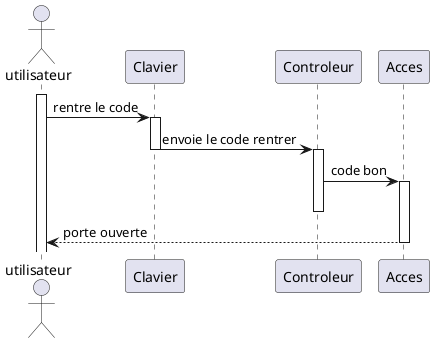

```plantuml
@startuml
actor utilisateur as user
participant Clavier as kBoard
participant Controleur as ctrl
participant Acces

activate user
user -> kBoard : rentre le code
activate kBoard
kBoard -> ctrl : envoie le code rentrer
deactivate kBoard
activate ctrl
ctrl -> Acces : code bon
activate Acces
deactivate ctrl
Acces --> user : porte ouverte
deactivate Acces
@enduml
```
